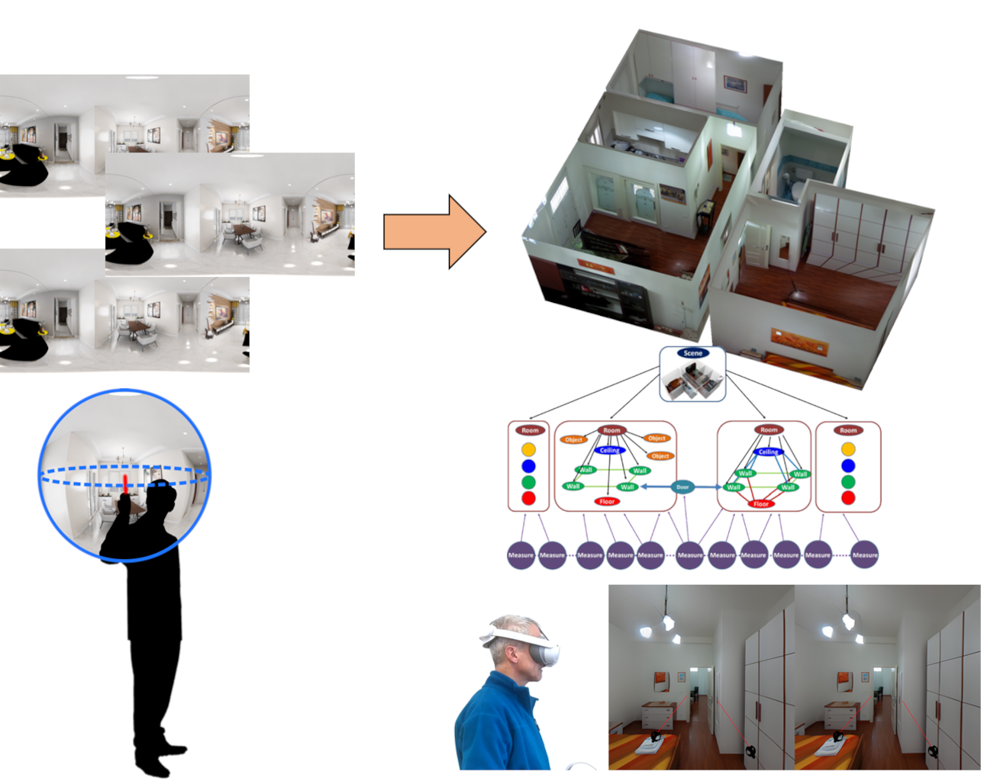

This repository presents preliminary results related to Task 2.7-WP2 in the HPCCN: National Center for HPC, Big Data and Quantum Computing Spoke 9 Digital Society and Smart Cities (See [PAGE](https://www.supercomputing-icsc.it/en/partnership/)). 
The HPCCN project promotes national and international-level innovation, building on a state-of-the-art infrastructure for computation and big data management. 
The results presented in this repository are specifically related to the Spoke 9 (Digital Cities) of the main project, concerning advanced AI solutions for rapidly inferring structured 3D interior building models from visual information and possibly other sensor data (depth, movement traces).

## Updates
* 2025-03-10: Updated documentation and results list.
* 2024-10-22: Preliminary results repository (this page) released to the public.
* 2024-10-22: Approach for predicting complex indoor floor plans public release.
* 2024-07-15: Approach for predicting complex indoor floor plans updated.
* 2024-07-10: Approach for predicting complex indoor floor plans first demo.
* 2024-01-12: Omnidirectional stereo methods updated.
* 2024-01-11: Omnidirectional stereo methods public demo release.

**Overview**:

The automatic 3D reconstruction, modeling, and exploration of indoor scenes have become a prominent and increasingly well-defined research topic in recent years. 
Current efforts are particularly focused on developing specialized techniques for common, highly structured multi-room environments, such as residential, office, or public buildings, which have a substantial impact on architecture, civil engineering, digital mapping, urban geography, real estate, and more. In this context, the emphasis has shifted from creating dense 3D models that assemble every measured geometric and visual detail to abstracting high-level structured models that are optimized for specific application-dependent characteristics and incorporate a degree of semantic information. Central to this research are the tasks of identifying architectural elements (such as rooms, walls, windows, and doors) and indoor objects, and integrating them into a coherent structured 3D representation and visual model.

Many options exist for performing capture, ranging from very low-cost commodity solutions to professional devices and systems. Among the many possible options, panoramic imagery is attracting a lot of interest, since it provides the widest cost-effective coverage with just a few shots. Furthermore, omnidirectional imagery is increasingly recognized as a critical element for creating immersive content from real-world scenes. A single-shot 360 image, which captures the entire surrounding environment, inherently supports a more dynamic form of exploration compared to traditional 2D imagery. When viewed through a Head-Mounted Display (HMD), it encourages viewers to explore the content by making natural head movements, thereby facilitating an intuitive virtual reality (VR) interface. For this reason, 360 image viewing has emerged as a primary mode for exploring real-world scenes in VR and is extensively used in applications such as indoor navigation. However, to provide essential depth cues—such as stereopsis or motion parallax—images alone are insufficient, and scene modeling or view synthesis is required.

Even with the extensive context provided by panoramic images, recovering accurate indoor models from visual input remains a highly challenging task due to the intrinsic characteristics of indoor environments, such as confined spaces, windows, textureless surfaces, non-cooperative materials, and abundant clutter. In response to these challenges, various indoor reconstruction techniques that leverage wide contextual information and specific geometric and holistic priors have been proposed in recent years. Notably, the growing availability of large-scale synthetic and reality-based data collections has facilitated the rise of data-driven and deep-learning approaches capable of relaxing the priors imposed by pure geometric reasoning by learning hidden relations from examples.

**Publications**:

- Giovanni Pintore, Marco Agus, and Enrico Gobbetti. Automatic 3D modeling and exploration of indoor structures from panoramic imagery. In SIGGRAPH Asia 2024 Courses (SA Courses '24), December 2024. ACM Press. DOI: 10.1145/3680532.3689580 
- Giovanni Pintore, Marco Agus, Alberto Signoroni, and Enrico Gobbetti. DDD: Deep indoor panoramic Depth estimation with Density maps consistency. In STAG: Smart Tools and Applications in Graphics, November 2024. DOI: 10.2312/stag.20241336.
- Uzair Shah, Sara Jashari, Muhammad Tukur, Giovanni Pintore, Enrico Gobbetti, Jens Schneider, and Marco Agus. VISPI: Virtual Staging Pipeline for Single Indoor Panoramic Images. In STAG: Smart Tools and Applications in Graphics, November 2024. DOI: 10.2312/stag.20241334. [BEST PAPER AWARD]
- Sara Jashari, Muhammad Tukur, Yehia Boraey, Uzair Shah, Mahmood Alzubaidi, Giovanni Pintore, Enrico Gobbetti, Alberto Jaspe-Villanueva, Jens Schneider, Noora Fetais, and Marco Agus. Evaluating AI-based static stereoscopic rendering of indoor panoramic scenes. In STAG: Smart Tools and Applications in Graphics, November 2024. DOI: 10.2312/stag.20241333.
-  Uzair Shah, Jens Schneider, Giovanni Pintore, Enrico Gobbetti, Mahmood Alzubaidi, Mowafa Househ, and Marco Agus. EleViT: exploiting element-wise products for designing efficient and lightweight vision transformers. In Proc. T4V - IEEE/CVF Conference on Computer Vision and Pattern Recognition Workshops (CVPRW), 2024.
-  Uzair Shah, Muhammad Tukur, Mahmood Alzubaidi, Giovanni Pintore, Enrico Gobbetti, Mowafa Househ, Jens Schneider, and Marco Agus. MultiPanoWise: holistic deep architecture for multi-task dense prediction from a single panoramic image. In Proc. OmniCV - IEEE/CVF Conference on Computer Vision and Pattern Recognition Workshops (CVPRW). Pages 1311-1321, 2024. DOI: 0.1109/CVPRW63382.2024.00138.
-  Giovanni Pintore, Alberto Jaspe-Villanueva, Markus Hadwiger, Jens Schneider, Marco Agus, Fabio Marton, Fabio Bettio, and Enrico Gobbetti. Deep synthesis and exploration of omnidirectional stereoscopic environments from a single surround-view panoramic image. Computers & Graphics, 119: 103907, March 2024. DOI: 10.1016/j.cag.2024.103907.

**Prototypes and demos**:
- Demo implementation of a novel deep synthesis and exploration of omnidirectional stereoscopic environments method [CODE AND DATA](https://github.com/crs4/DeepOmniStereoFromMonoIndoorPano)
- Demo implementation of deep-learning approach for predicting complex indoor floor plans from registered omnidirectional images [CODE AND DATA](https://github.com/crs4/Indoor-floor-plans-prediction)
